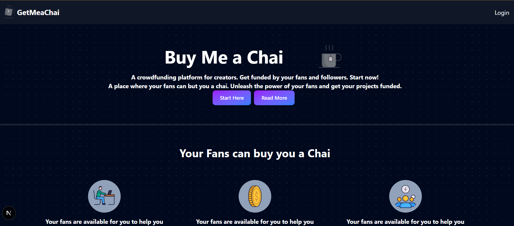

# ☕ Get Me A Chai

**Get Me A Chai** is a modern crowdfunding platform built for creators to receive support from their fans. Fans can "buy a chai" for their favorite creators, providing a simple and interactive way to fund projects and show appreciation.



## 🚀 Features

- **Creator Profiles**: Personalized pages for creators to showcase their work and receive payments.
- **Secure Payments**: Integrated with **Razorpay** for seamless and secure transactions.
- **Authentication**: Easy login using **GitHub** powered by **NextAuth.js**.
- **Dashboard**: Creators can manage their profile and track contributions.
- **Modern UI**: Built with **Next.js 15**, **React 19**, and **Tailwind CSS** for a fast, responsive, and beautiful experience.
- **Database**: **MongoDB** integration via Mongoose for robust data management.

## 🛠️ Tech Stack

- **Framework**: [Next.js 15](https://nextjs.org/) (App Router)
- **Styling**: [Tailwind CSS](https://tailwindcss.com/)
- **Authentication**: [NextAuth.js](https://next-auth.js.org/)
- **Payment Gateway**: [Razorpay](https://razorpay.com/)
- **Database**: [MongoDB](https://www.mongodb.com/) with [Mongoose](https://mongoosejs.com/)
- **Deployment**: [Vercel](https://vercel.com/)

## ⚙️ Getting Started

### Prerequisites

- Node.js (Latest LTS recommended)
- MongoDB Atlas account or local MongoDB instance
- Razorpay account (for API keys)
- GitHub Developer account (for OAuth)

### Installation

1. **Clone the repository:**
   ```bash
   git clone https://github.com/your-username/get-me-a-chai.git
   cd get-me-a-chai
   ```

2. **Install dependencies:**
   ```bash
   npm install
   ```

3. **Set up environment variables:**
   Create a `.env.local` file in the root directory and add the following:

   ```env
   GITHUB_ID=your_github_id
   GITHUB_SECRET=your_github_secret
   
   NEXT_PUBLIC_KEY_ID=your_razorpay_key_id
   KEY_SECRET=your_razorpay_key_secret
   
   MONGODB_URI=your_mongodb_connection_string
   
   NEXT_PUBLIC_URL=http://localhost:3000
   NEXTAUTH_URL=http://localhost:3000
   NEXTAUTH_SECRET=your_nextauth_secret
   ```

4. **Run the development server:**
   ```bash
   npm run dev
   ```

5. **Open the app:**
   Navigate to [http://localhost:3000](http://localhost:3000) to see the result.

## 📁 Project Structure

```text
├── app/              # Next.js App Router (Pages & API)
├── components/       # Reusable UI Components
├── db/               # Database connection logic
├── models/           # Mongoose models (User, etc.)
├── public/           # Static assets (images, gifs)
├── actions/          # Server actions
└── ...
```